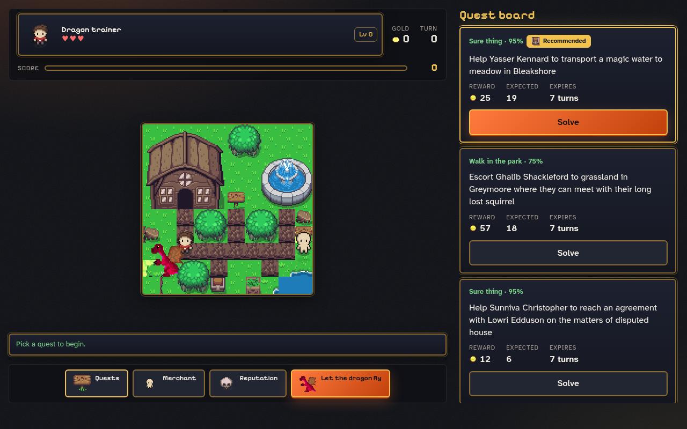

# Dragons of Mugloar

A bot that plays [Dragons of Mugloar](https://dragonsofmugloar.com) past 1000 points, and a web game where you play it yourself with the bot's advice next to every quest.

[](https://github.com/rax1110/dragons-game/actions/workflows/ci.yml)



## Run it

You need Docker with Compose v2. Tested with Docker 29 and Compose 5 on Linux.

```sh
docker compose up --build
```

- Play: http://localhost:3000
- API docs: http://localhost:3000/api/docs

Run the bot on its own. It prints one line per turn and exits with 0 once the game has passed 1000 points.

```sh
docker compose run --rm bot
```

```
turn 24 | solve Walk in the park: Infiltrate The Grizzly Boar Brotherhood and recover their secrets. | You successfully solved the mission! | score 1080 gold 380 lives 3 level 7
...
Game gqyIMh8B over after 256 turns: score 6124, level 12 (reached 1000 at turn 24)
```

Stop everything with `docker compose down`. If port 3000 is taken, change the left side of the port mapping in `compose.yaml`.

## Where to look

| Asked for                        | Where it is                                                                                                                                                                                  |
| -------------------------------- | -------------------------------------------------------------------------------------------------------------------------------------------------------------------------------------------- |
| Web app                          | `apps/web`: React 19 and Vite, a pixi.js town, a quest board with the bot's advice, merchant and reputation dialogs, and autoplay.                                                           |
| Responsive, cross-browser        | Mobile-first CSS modules and standard web platform features only. The same build serves phones and desktops.                                                                                 |
| State management                 | One Zustand store, `apps/web/src/features/game/game-store.ts`, with actions, selectors and the game id persisted per tab. Unit-tested without React.                                         |
| Bot that reaches 1000 points     | `packages/game-core/src/bot` holds the policy, `apps/api/src/cli/play.ts` runs it.                                                                                                           |
| Error handling, input validation | zod parses the environment, every game API payload and every route parameter. Game API failures become typed errors mapped to 404, 409, 410 or 502, and the UI explains them in plain words. |
| Unit tests                       | 104 tests: 41 in game-core, 29 in the API, 34 in the web app. CI runs typecheck, lint, tests and build.                                                                                      |

`packages/game-core` is plain TypeScript with the API schemas, quest decoding and ranking, and the bot. `apps/api` is NestJS: it talks to the game API, keeps one session per game, ranks quests, plays bot turns and serves the web build. The game API calls quests "messages" or "ads"; the code uses "ads". The pixel art comes from CC0 and CC BY packs listed in [CREDITS.md](CREDITS.md).

## How the bot plays

Each turn it takes the first rule that applies:

1. Heal when below 3 lives and a potion is affordable.
2. Stop spending once no safe quest has shown up for 10 turns.
3. Buy the cheapest upgrade while healthy, keeping one potion's worth of gold.
4. Solve the recommended quest: the best expected value among quests with at least a 55% chance that do not hurt reputation.
5. Otherwise buy a potion to pass the turn, or take the least risky quest.

Expected value is `chance × reward − (1 − chance) × life value`, where a life is worth 100 gold at 3 lives and 300 at 1. Quests about stealing, killing or taking the blame are never recommended: they lead to traps.

In 12 live games with this policy the bot passed 1000 points between turns 24 and 32 and finished between 3600 and 6100. The game is random, so this is a measurement, not a guarantee. In every game we played, across a dozen variants of this policy, the quest pool turned to "Suicide mission" and "Impossible" somewhere after turn 60. The public high-score list goes into the millions, so there is a way past that which this bot does not find.

## Develop

You need Node 24 and pnpm.

```sh
pnpm install
pnpm dev                          # API on :3000, web on :5173
pnpm test
pnpm typecheck && pnpm lint
pnpm build && pnpm --filter @dragons/api play   # the bot without Docker
```

Settings come from the environment: `PORT` (3000), `GAME_API_BASE_URL`, `GAME_API_TIMEOUT_MS` (10000).

## Decisions and limits

- One image, one port: NestJS serves the web build, so there is no CORS and no second server.
- The rules run on the server. The browser renders ranked quests and drives autoplay one turn at a time.
- Sessions live in memory, up to 1000 games. A reload keeps the game id in the tab's session storage.
- No authentication or rate limiting: there is nothing to protect and the app is meant to run locally.
